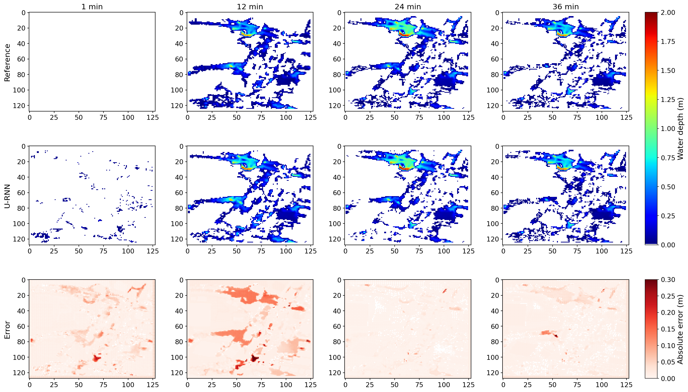
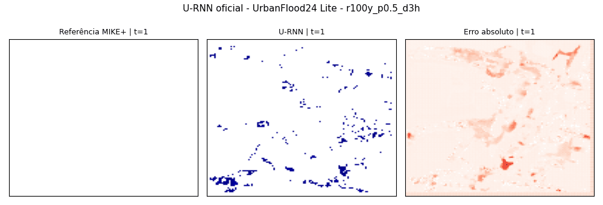

# Implementação Funcional de Nowcasting Espaço-Temporal de Inundações Urbanas com U-RNN


**Estudante:** Mateus Zanco Tatsch   
**Período da atividade:** 20/06/2026 a 04/07/2026  
**Tema:** Nowcasting espaço-temporal de inundações urbanas inspirado no U-RNN

## Objetivo

Este repositório entrega uma solução funcional e auditável de nowcasting de inundações urbanas baseada no artigo **U-RNN high-resolution spatiotemporal nowcasting of urban flooding** e no repositório oficial `holmescao/U-RNN`.

A entrega tem duas rotas complementares:

1. **Rota principal, oficial e mais realista:** notebook para Google Colab com GPU usando o repositório oficial U-RNN, UrbanFlood24 Lite, evento demonstrativo oficial e pesos pré-treinados oficiais.
2. **Rota local didática:** notebook executável em CPU com uma mini U-RNN/ConvGRU e dados sintéticos, usado para explicar o pipeline de nowcasting, treinamento, inferência autorregressiva, métricas e geração de saídas.

A rota principal é a evidência mais importante da entrega, pois usa dados e pesos oficiais. A rota local existe para manter a solução executável mesmo em hardware sem GPU e para demonstrar entendimento técnico.

## Referências Utilizadas

- Artigo: **U-RNN high-resolution spatiotemporal nowcasting of urban flooding**, Journal of Hydrology, 659, 133117. DOI: https://doi.org/10.1016/j.jhydrol.2025.133117
- GitHub oficial do U-RNN: https://github.com/holmescao/U-RNN
- Link de dataset/repositório indicado no artigo: https://github.com/holmescao/URNN
- Pesos pré-treinados oficiais usados no Colab: `loc1_lite_weights.zip`
- Dataset demonstrativo usado no Colab: `loc1_lite_demo_r100y.zip`


## Partes Usadas Como Guia Técnico

### Artigo U-RNN

Foram usados como guia técnico:

- uso de blocos recorrentes convolucionais, especialmente a ideia de **Skip-ConvGRU**;
- noção de entradas dinâmicas de chuva e entradas espaciais estáticas;
- ideia de saídas desacopladas para classificação seco/molhado e regressão de profundidade;
- paradigma **Sliding Window-based Pre-warming (SWP)**, estudado conceitualmente;
- métricas e formas de avaliação, como erro de profundidade, extensão inundada e comparação com referência hidrodinâmica.

### GitHub Oficial `holmescao/U-RNN`

Foram usados como guia técnico:

- estrutura do repositório oficial;
- tutoriais de dataset, pesos pré-treinados e inferência;
- configuração `configs/lite.yaml`;
- script oficial `test.py`;
- convenção de organização de saídas em `exp/<timestamp>/figs` e `exp/<timestamp>/metrics`;
- pesos pré-treinados oficiais `loc1_lite_weights.zip`;
- evento demonstrativo oficial `loc1_lite_demo_r100y.zip`;
- comando de inferência com `--timestamp 20260316_130418_443889`.

No notebook Colab, essa referência foi usada diretamente: o repositório oficial é clonado, os pesos e dados são baixados, e o `test.py` é executado com a configuração Lite.

### Dataset e Material Suplementar

Foram usados como guia técnico:

- dataset **UrbanFlood24 Lite**, por ser uma versão reduzida adequada ao Colab;
- localidade `location1`;
- evento demonstrativo `r100y_p0.5_d3h`;
- arquivo `flood.npy`, com shape `(36, 128, 128)`;
- arquivo `rainfall.npy`, com shape `(18,)`;
- referência hidrodinâmica usada para comparar a predição do U-RNN;
- métricas oficiais salvas em `metrics_epoch100.xlsx`.

O dataset UrbanFlood24 completo não foi baixado porque tem aproximadamente 115 GB. Por isso, a entrega usa UrbanFlood24 Lite e pesos pré-treinados oficiais como rota principal. A rota local em CPU usa dados sintéticos apenas como complemento didático.

## Problema Resolvido pelo U-RNN

O U-RNN aborda o problema de **nowcasting de inundações urbanas**, isto é, a previsão de curto prazo da evolução da inundação no espaço e no tempo durante um evento de chuva. Diferente de um mapa estático de suscetibilidade, o nowcasting estima como a mancha de inundação se propaga ao longo dos instantes temporais.

Essa distinção é importante:

- **Suscetibilidade:** indica áreas propensas a inundar, normalmente de forma mais estática.
- **Nowcasting:** estima a evolução temporal da inundação, por exemplo minuto a minuto.
- **Risco:** exigiria também exposição, vulnerabilidade, população, infraestrutura crítica e impactos potenciais. Esta entrega não implementa um modelo completo de risco.

O U-RNN se relaciona diretamente com inundações urbanas porque combina dados de chuva, características espaciais da bacia urbana e estados temporais recorrentes para produzir mapas dinâmicos de profundidade de inundação.

## Entradas e Saídas Esperadas

No artigo e no repositório oficial, o U-RNN trabalha com entradas dinâmicas e estáticas organizadas em grade espacial 2D.

Entradas principais:

- intensidade de chuva ao longo do tempo;
- chuva acumulada;
- variáveis espaciais estáticas, como superfície/elevação, impermeabilidade e drenagem;
- estados recorrentes internos que carregam informação histórica da sequência.

Saídas principais:

- mapas temporais de profundidade de inundação;
- classificação de célula seca/molhada;
- comparação entre predição U-RNN e referência hidrodinâmica;
- métricas objetivas, como `R²`, `RMSE`, `MAE`, `PeakR²` e `CSI`;
- figuras e GIFs com a evolução temporal da inundação.

## Arquitetura U-like, ConvGRU e SWP

A arquitetura U-RNN segue uma estrutura do tipo **U-like encoder-decoder**. O codificador reduz a resolução espacial para capturar padrões mais amplos, enquanto o decodificador reconstrói mapas na resolução original. O modelo usa blocos recorrentes convolucionais, chamados no artigo de **Skip-ConvGRU**, que combinam convoluções espaciais com memória temporal.

A ideia central é aprender dependências espaço-temporais complexas: a água acumulada em um ponto depende da chuva atual, da chuva passada, do terreno, da drenagem, da impermeabilidade e da propagação de água nas células vizinhas.

O artigo também apresenta o paradigma **Sliding Window-based Pre-warming (SWP)**. Em vez de treinar sequências longas completas com alto custo de memória, o SWP usa janelas temporais menores e pré-aquece os estados históricos por inferência sem gradiente. Isso reduz a demanda de memória de GPU e ajuda o modelo a manter previsões estáveis em sequências longas.

Nesta entrega, o SWP é estudado e explicado conceitualmente. A reprodução completa do treinamento do artigo não foi realizada por limitações de infraestrutura e tamanho do dataset. A inferência oficial com pesos pré-treinados foi priorizada.

## Estratégia Técnica da Entrega

### Rota 1: Colab/GPU com U-RNN Oficial

Arquivo:

```text
notebooks/spatiotemporal_nowcasting_of_urban_flooding_u-rnn_colab_gpu.ipynb
```

Essa rota:

- clona o repositório oficial `holmescao/U-RNN`;
- baixa os pesos oficiais `loc1_lite_weights.zip`;
- baixa o evento demonstrativo `loc1_lite_demo_r100y.zip`;
- executa o script oficial `test.py` com `configs/lite.yaml`;
- usa o evento `r100y_p0.5_d3h` da `location1`;
- gera figura oficial, GIF oficial e métricas oficiais.

Configuração da execução verificada:

```text
GPU: Tesla T4, 15360 MiB
PyTorch: 2.11.0+cu128
CUDA disponível: True
Dataset: UrbanFlood24 Lite
Evento: r100y_p0.5_d3h
Grade: 128 x 128
Passos temporais: 36
Tempo de inferência: 6.55 s
Tempo médio por passo: 0.18 s
```

### Rota 2: CPU Local com Mini U-RNN Didática

Arquivo:

```text
notebooks/spatiotemporal_nowcasting_of_urban_flooding_u-rnn.ipynb
```

Essa rota:

- gera dados sintéticos de chuva, terreno, impermeabilidade e drenagem;
- cria uma referência sintética de inundação por regra simplificada;
- treina uma mini rede U-like com célula ConvGRU;
- executa inferência autorregressiva;
- salva figuras, GIF, métricas e logs em `outputs/`.

Ela não substitui a inferência oficial. Seu papel é didático e reprodutível em CPU.

## Estrutura do Repositório

```text
.
+-- README.md
+-- COLAB.md
+-- requirements.txt
+-- requirements_colab.txt
+-- etapas_desenvolvimento.md
+-- notebooks/
|   +-- spatiotemporal_nowcasting_of_urban_flooding_u-rnn.ipynb
|   +-- spatiotemporal_nowcasting_of_urban_flooding_u-rnn_colab_gpu.ipynb
+-- outputs/
|   +-- colab/
|   |   +-- metrics_epoch100.xlsx
|   |   +-- u_rnn_official_urbanflood24_lite.gif
|   |   +-- u_rnn_official_urbanflood24_lite.png
|   +-- animacoes/
|   +-- figuras/
|   +-- logs/
|   +-- metricas/
+-- referencias/              # material local de estudo; pode não ser publicado
    +-- artigo_referencia.pdf
    +-- desenvolvimento_esperado.pdf
```

## Instalação e Execução Local em CPU

O ambiente local foi validado com:

```text
Python: 3.12.13
PyTorch: 2.12.1+cpu
Dispositivo: CPU
```

Preparação recomendada:

```bash
python3 -m pip install uv
UV_PYTHON_INSTALL_DIR=.python uv python install 3.12 --cache-dir .uv-cache
UV_PYTHON_INSTALL_DIR=.python uv venv .venv --python 3.12 --seed --cache-dir .uv-cache
.venv/bin/pip install -r requirements.txt
```

Abrir o notebook local:

```bash
.venv/bin/jupyter notebook notebooks/spatiotemporal_nowcasting_of_urban_flooding_u-rnn.ipynb
```

O `requirements.txt` usa PyTorch CPU-only e não deve ser usado no Colab com GPU.

## Execução no Google Colab com GPU

Use o notebook:

```text
notebooks/spatiotemporal_nowcasting_of_urban_flooding_u-rnn_colab_gpu.ipynb
```

Passos:

1. Abrir o notebook no Google Colab.
2. Selecionar `Ambiente de execução` > `Alterar tipo de ambiente de execução` > `GPU`.
3. Executar as células em ordem até a seção `GIF da inferência oficial`.
4. Baixar os arquivos gerados em `/content/outputs_urnn_official/`.

Os arquivos baixados para esta entrega foram colocados em:

```text
outputs/colab/
```

## Dados Utilizados

### Dados Oficiais no Colab

A execução principal usa o **UrbanFlood24 Lite**, uma versão reduzida do UrbanFlood24, adequada para execução demonstrativa em Colab.

Arquivos oficiais usados:

- pesos: `loc1_lite_weights.zip`;
- evento demo: `loc1_lite_demo_r100y.zip`;
- localidade: `location1`;
- evento: `r100y_p0.5_d3h`;
- `flood.npy`: shape `(36, 128, 128)`;
- `rainfall.npy`: shape `(18,)`.

O dataset UrbanFlood24 completo tem aproximadamente 115 GB e não foi baixado. A escolha pelo UrbanFlood24 Lite, evento demonstrativo e pesos pré-treinados é justificada pela limitação de hardware local sem GPU e pelo volume do dataset completo.

### Dados Sintéticos Locais

A execução local usa dados sintéticos gerados no próprio notebook:

- grade urbana simplificada;
- campo sintético de elevação;
- impermeabilidade;
- drenagem;
- chuva temporal;
- referência sintética de profundidade de água.

Esses dados são uma simplificação didática e não devem ser interpretados como simulação hidrodinâmica real.

## Resultados Oficiais do Colab

Métricas obtidas em `outputs/colab/metrics_epoch100.xlsx`:

| Evento | R² | MSE | RMSE (m) | MAE (m) | PeakR² | CSI |
|---|---:|---:|---:|---:|---:|---:|
| `r100y_p0.5_d3h` | 0.980804 | 0.000388 | 0.019692 | 0.010683 | 0.996701 | 0.941799 |

Interpretação:

- O `R² = 0.980804` indica forte aderência entre predição e referência.
- O `RMSE = 0.019692 m` representa erro médio quadrático de aproximadamente 1,97 cm.
- O `MAE = 0.010683 m` representa erro absoluto médio de aproximadamente 1,07 cm.
- O `CSI = 0.941799` indica boa correspondência da área inundada prevista.
- O resultado é coerente com a expectativa de uma inferência oficial com pesos pré-treinados, embora seja apenas um evento demonstrativo e não uma validação ampla.

Figura oficial:



GIF oficial:



## Resultados Locais em CPU

Resumo da execução local registrado em `outputs/logs/resumo_execucao.json`:

| Métrica | Valor |
|---|---:|
| Grade | 32 x 32 |
| Passos temporais | 24 |
| Eventos de treino | 10 |
| Eventos de teste | 3 |
| Épocas | 15 |
| MAE médio | 0.029756 m |
| RMSE médio | 0.037266 m |
| CSI médio | 0.844804 |
| Profundidade máxima da referência | 0.252080 m |
| Profundidade máxima prevista | 0.163387 m |

Arquivos locais gerados:

- `outputs/figuras/entrada_chuva.png`
- `outputs/figuras/variaveis_espaciais.png`
- `outputs/figuras/comparacao_predicao_referencia.png`
- `outputs/figuras/metricas_temporais.png`
- `outputs/animacoes/nowcasting.gif`
- `outputs/metricas/metricas.csv`
- `outputs/metricas/historico_treinamento.csv`
- `outputs/logs/resumo_execucao.json`

## Avaliação dos Resultados

A execução oficial no Colab atingiu o objetivo principal da atividade: executou o pipeline oficial do U-RNN com pesos pré-treinados, dataset oficial reduzido, GPU, figura, GIF e métricas verificáveis.

A execução local em CPU também cumpre seu papel: mostra um pipeline completo e comentado de geração de dados, treinamento, inferência, métricas e visualizações. Entretanto, ela é uma aproximação didática, não uma reprodução fiel do artigo.

Um ponto observado na seção sintética do Colab é que a métrica de área inundada pode não acompanhar a referência quando a mini U-RNN subestima a profundidade e fica abaixo do limiar de célula inundada. Isso reforça que os resultados oficiais em `outputs/colab/` devem ser usados como evidência principal.

## Limitações

- O treinamento completo do artigo não foi reproduzido.
- O UrbanFlood24 completo não foi baixado por volume e demanda computacional.
- A execução oficial usa apenas um evento demonstrativo do UrbanFlood24 Lite.
- A avaliação oficial depende de pesos pré-treinados.
- A seção sintética local não é um solver hidrodinâmico real.
- Não há integração com sensores reais, estações pluviométricas, radar meteorológico, satélite ou dados urbanos operacionais.
- A entrega não constitui um modelo completo de risco, pois não integra exposição, vulnerabilidade e impacto.

## Relação com o Americas TechGuard

Uma solução de nowcasting como o U-RNN pode apoiar o Americas TechGuard em:

- monitoramento de eventos extremos em tempo quase real;
- antecipação de áreas urbanas com maior profundidade de alagamento;
- priorização de resposta operacional;
- geração de alertas baseados em previsão temporal, não apenas em suscetibilidade estática;
- integração futura com sensores de chuva, radar, satélite, bases geoespaciais e dashboards;
- análise de impacto em infraestrutura crítica, vias, hospitais, escolas e áreas vulneráveis.

Para uma prova de conceito robusta em cenário real, ainda seriam necessários:

- dados pluviométricos reais e contínuos;
- validação em múltiplos eventos;
- calibração por cidade/bacia;
- integração com geoprocessamento operacional;
- avaliação de incerteza;
- camada de exposição e vulnerabilidade para transformar nowcasting em apoio efetivo à análise de risco.
